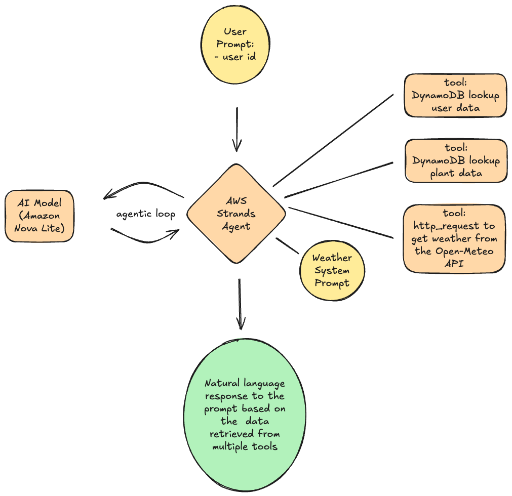
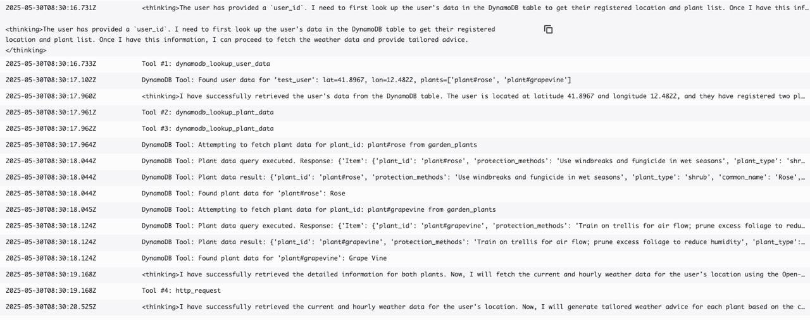

## Gardening Agent

This gardening agent has been built using the AWS Strands Agents SDK. The Python code for the agent is located in ```agent.py``` -file and has been deployed using a 
Lambda function. The agent has access to AI model (Amazon Nova Lite) and utizes three tools. The first tool is a Strands built-in tool 'http_request', which the agent
can utilize to fetch weather data. In addition there are two custom tools that enable the agent to fetch data from DynamoDB. The agent is able to fetch
user data, which contains a list of garden plants the user has. The agent is also able to fetch plant-specific details from a second DynamoDB table. Based on this data, the
AI model is able to create tailored weather-related advice for a user's specific plants.



The Lambda function is triggered by an event that contains the user ID. The weather system prompt explains the detailed use case of acting as a gardening weather advisor.
The prompt and details of available tools are sent to the AI model and the data is retrieved and combined based on the AI model's plan:



Finally, the AI model will create a natural language response which the agent can return to the client:
``
Both plants are currently within their ideal temperature and humidity ranges. However, the forecast shows temperatures 
rising above the ideal range for both plants. Consider providing some shade or shelter to protect them from excessive heat.
``

## Deploy Agent as a Lambda Function

The Lambda function requires the following permissions:

- `dynamodb:GetItem` access for both DynamoDB tables
- `bedrock:InvokeModelWithResponseStream`

You can create a Lambda layer based on the `requirements.txt` file to include your Python dependencies.


## Access to Bedrock

The Lambda function uses Amazon Nova Lite model and access to these model needs to be requested through the Bedrock console. 


## DynamoDB Tables Setup

This project requires **two DynamoDB tables**:

---

### 1. `plant_database_users`

- **Primary Key**: `user_id` (String)

#### Example item:

```json
{
  "user_id": "test_user",
  "latitude": "41.8967",
  "longitude": "12.4822",
  "plants": [
    "plant#rose",
    "plant#grapevine"
  ]
}
```

### 2. `garden_plants`

- **Primary Key**: `plant_id` (String)

#### Example item:

```json
{
  "plant_id": "plant#rose",
  "common_name": "Rose",
  "scientific_name": "Rosa spp.",
  "plant_type": "shrub",
  "min_temp_c": -15,
  "max_temp_c": 35,
  "ideal_temp_range_c": [15, 26],
  "frost_tolerance": true,
  "sunlight_requirement": "full sun",
  "max_daily_sunlight_hours": 10,
  "min_daily_sunlight_hours": 6,
  "watering_frequency_days": 3,
  "soil_moisture_preference": "moist",
  "rainfall_tolerance_mm_per_day": 25,
  "ideal_humidity_range_percent": [40, 70],
  "humidity_tolerance": "moderate",
  "wind_tolerance_kmph": 30,
  "requires_staking": false,
  "soil_type_preference": "loamy",
  "ph_preference": "slightly acidic",
  "drainage_needs": "well-drained",
  "shelter_requirement": false,
  "growing_season": "spring-summer",
  "dormant_season": "winter",
  "last_frost_date_safe_planting": "2024-04-15",
  "first_frost_date_end_of_growth": "2024-10-30",
  "special_weather_notes": "Mulch in winter to protect roots in colder climates",
  "common_weather_risks": "Black spot and mildew in high humidity",
  "protection_methods": "Use windbreaks and fungicide in wet seasons",
  "growth_stage": "vegetative"
}
